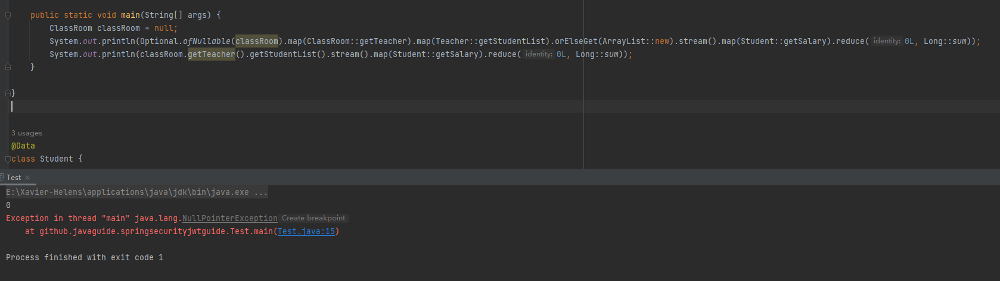

# Java 8 新特性

---

- ***Optional***
  
    ```java
    ClassRoom classRoom = null;
    
    //使用map避免NPE
    Long reduce = Optional.ofNullable(classRoom)
    											.map(ClassRoom::getTeacher)
    											.map(Teacher::getStudentList)
    											.orElseGet(ArrayList::new)
    											.stream()
    											.map(Student::getSalary)
    											.reduce(0L, Long::sum);
    
    //NPE
    Long sum = classRoom.getTeacher()
    										.getStudentList()
    										.stream()
    										.map(Student::getSalary)
    										.reduce(0L, Long::sum);
    ```
    
    
    

---

- ***Collectors.collectingAndThen***
  
    先进行结果集的收集，然后将收集到的结果集进行下一步的处理
    
    ```java
    //把第一个参数downstream的结果，交给第二个参数Function函数的参数里面
    public static<T,A,R,RR> Collector<T,A,RR> collectingAndThen(Collector<T,A,R> downstream, Function<R,RR> finisher)
    ```
    
    ```java
    //获取子公司为上海公司，工资最高的员工
    
    Optional<Employee> employee = getAllEmployees().stream()
                    .filter(e -> StringUtils.equals("上海公司", e.getSubCompany()))
                    .max(Comparator.comparingInt(Employee::getSalary));
    
    Employee employee = getAllEmployees().stream()
            .filter(e -> StringUtils.equals("上海公司", e.getSubCompany()))
            .collect(Collectors.collectingAndThen(
    							Collectors.maxBy(Comparator.comparingInt(Employee::getSalary)), Optional::get
    				));
    
    ```